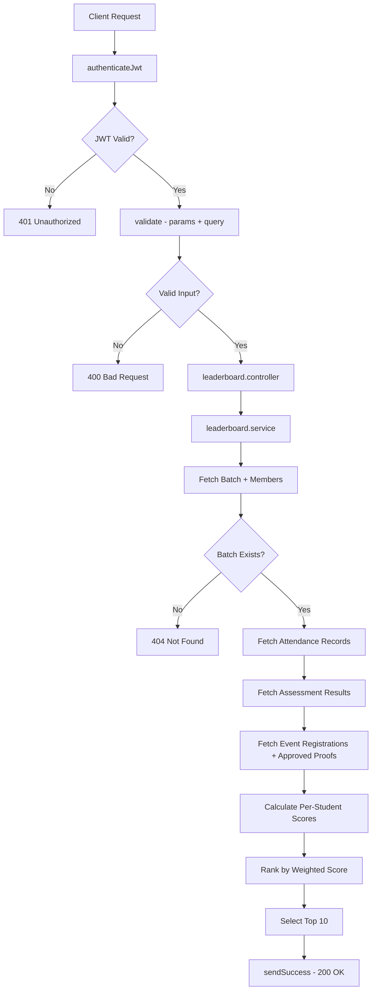
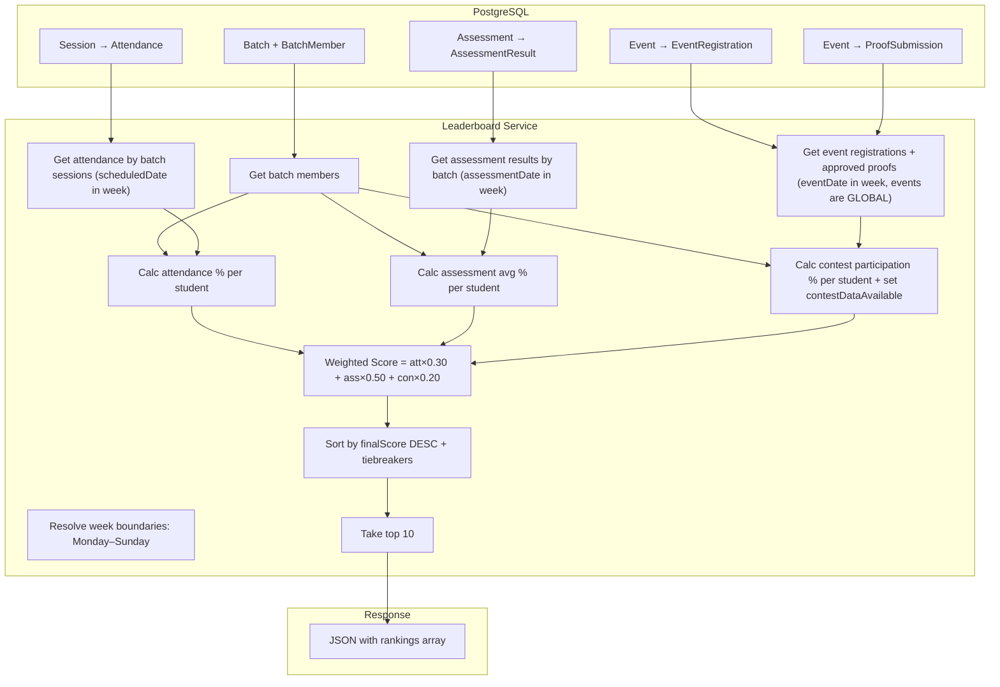
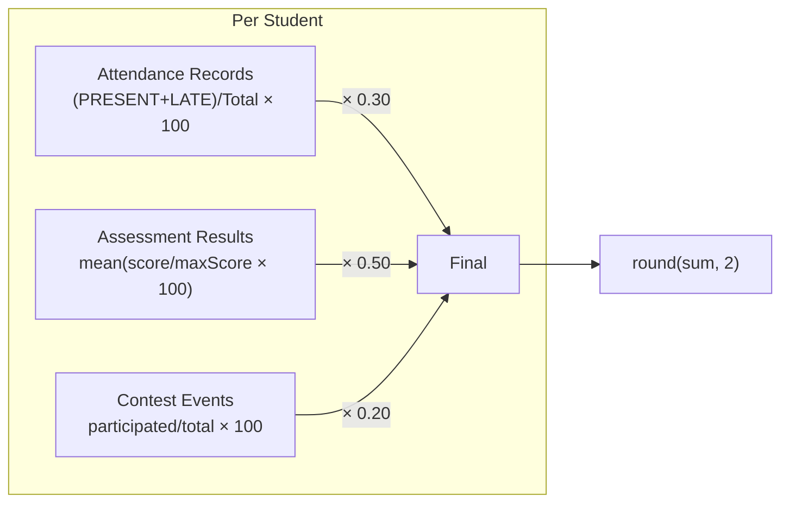

# Module 18 — Weekly High-Achiever Leaderboard

## Comprehensive Implementation Document

**Module Owner:** Module 18 Assignee
**Date:** 2026-10-06
**Status:** Implementation Plan (Not Yet Implemented)
**Repository:** `joannakiruba/Engagement-Intelligence-Platform`

---

# Table of Contents

1. [Executive Summary](#1-executive-summary)
2. [Repository Inspection Results](#2-repository-inspection-results)
3. [Existing Architecture](#3-existing-architecture)
4. [Data Source Analysis](#4-data-source-analysis)
5. [Leaderboard Formula Design](#5-leaderboard-formula-design)
6. [Weekly Logic Design](#6-weekly-logic-design)
7. [API Design](#7-api-design)
8. [File-Level Implementation Plan](#8-file-level-implementation-plan)
9. [Backend Flow Diagrams](#9-backend-flow-diagrams)
10. [Database Analysis](#10-database-analysis)
11. [Frontend Analysis](#11-frontend-analysis)
12. [Testing Plan](#12-testing-plan)
13. [Edge Cases](#13-edge-cases)
14. [Security / RBAC](#14-security--rbac)
15. [Performance Considerations](#15-performance-considerations)
16. [Implementation Order](#16-implementation-order)
17. [Implementation Rules for Claude Code](#17-implementation-rules-for-claude-code)
18. [How I Should Explain Module 18 to My Mentor](#18-how-i-should-explain-module-18-to-my-mentor)
19. [Summary](#19-summary)
20. [FINAL IMPLEMENTATION DECISIONS](#20-final-implementation-decisions)

---

# 1. Executive Summary

Module 18 implements a **Weekly High-Achiever Leaderboard** that displays the top 10 students per batch, ranked by a weighted composite score:

| Component | Weight | Source |
|---|---|---|
| Attendance | 30% | `Attendance` model (Module 5 — **Complete**) |
| Average Assessment | 50% | `AssessmentResult` model (Module 6 — **Complete**) |
| Contest Participation | 20% | `EventRegistration` + `ProofSubmission` models (Module 17 — **Partially Complete**) |

### Key Finding

Module 17 (Events) is **partially implemented**. Event CRUD and Proof Submission exist, but **Event Registration endpoints do not exist** (no POST route for students to register). However, the `EventRegistration` **Prisma model exists** in the schema and the `ProofSubmission` model is fully functional. The seed data does not populate event registrations.

### ⚠️ Unresolved Requirement: Contest Event Identification

`Event.eventType` is a **free-text `String`** (not an enum). The repository has no predefined values, no seed data for events, and no validation constraining what values `eventType` can hold. There is **no reliable way to distinguish a "contest" event from a "workshop" or "seminar" event** without either:
- An agreed-upon convention (e.g., `eventType = 'CONTEST'` or `'HACKATHON'`)
- A schema change adding a boolean `isContest` flag or converting `eventType` to an enum

Additionally, the `Event` model has **no `batchId` field** — events are global, not scoped to a batch. All events in the selected week are counted for all batches equally.

> **🔴 NEEDS MENTOR CONFIRMATION:** How should contest events be identified? Options:
> 1. Treat **all events** as contests (simplest — every event counts toward participation).
> 2. Filter by `eventType` string match (e.g., `eventType IN ('CONTEST', 'HACKATHON')`) — requires an agreed convention.
> 3. Add a boolean `isContest` field to the `Event` model — requires a schema migration.
>
> **Default assumption: Option 1 (all events count)** until confirmed otherwise.

Note: `AssessmentType` has a `CONTEST` enum value, but that is for assessments, not events. These are distinct models.

### ⚠️ Unresolved Requirement: What Counts as Contest Participation

A student can appear in two models related to events:
- `EventRegistration` — student registered for the event (any record = participated)
- `ProofSubmission` — student submitted proof (has a `status`: PENDING, APPROVED, or REJECTED)

> **🔴 NEEDS MENTOR CONFIRMATION:** Which records count as "participated"?
>
> **Default assumption:** A student participated in an event if they have an `EventRegistration` **OR** a `ProofSubmission` with status `APPROVED` for that event, deduplicated by eventId.
>
> - `EventRegistration` exists → participated (registration is an affirmative act)
> - `ProofSubmission` with status `APPROVED` → participated (confirmed by reviewer)
> - `ProofSubmission` with status `PENDING` → **not yet counted** (unconfirmed — reviewer has not verified participation)
> - `ProofSubmission` with status `REJECTED` → **not counted** (reviewer determined submission was invalid)
>
> Alternative: count all `ProofSubmission` records regardless of status (any submission = participation attempt). This is simpler but counts rejected/unverified submissions.

### ⚠️ Unresolved Requirement: Weight Normalization When Contest Data Unavailable

When no contest/event data exists (Module 17 incomplete), the contest score is 0 for all students. This creates a mathematical penalty — the maximum achievable score drops from 100 to 80. Two approaches:

> **🔴 NEEDS MENTOR CONFIRMATION:** How should scores work when contest data is unavailable?
>
> **Option A — Strict 30/50/20 (keep formula unchanged):**
> - `finalScore = att×0.30 + assess×0.50 + 0×0.20`
> - Maximum possible score = 80 (not 100)
> - All students penalized equally — relative ranking is unaffected
> - Simpler to implement and explain
>
> **Option B — Normalize to available weights (37.5/62.5/0):**
> - When contest data is unavailable: `finalScore = att×0.375 + assess×0.625`
> - Maximum possible score = 100
> - More "fair" — scores reflect full potential
> - Formula changes depending on data availability, harder to explain
>
> This document assumes **Option A (strict formula)** until confirmed otherwise, because relative ranking between students is identical under both options, and Option A is simpler.

### Authentication / Authorization Decision

The leaderboard follows the **engagement dashboard pattern**: authentication only (JWT), no RBAC permission codes. Any authenticated user can view any batch's leaderboard. This matches how `/api/engagement` routes work — they use `authenticateJwt` only, with no `requirePermission` or `resolveScope`. See Section 14 for full rationale.

**Consequence:** There is no server-side batch restriction. A student in Batch A can view Batch B's leaderboard. The frontend may choose to default to the user's own batch, but the API does not enforce this.

### Recommended Approach

Implement Module 18 with all three components. For contest participation, use `EventRegistration` and `ProofSubmission` records that exist in the database. The contest component **gracefully degrades** when no data exists — but the implementation must clearly distinguish between two states:

1. **Contest data unavailable** (`contestDataAvailable: false`): No events exist in the system during the selected week. Every student gets `contestScore = 0`. The frontend shows a banner explaining the component is inactive. The score penalty is uniform.

2. **Contest data available but student did not participate** (`contestDataAvailable: true`, `contestScore = 0`): Events exist, but a particular student has no qualifying registrations or approved proof submissions. That student's `contestScore = 0` reflects genuine non-participation — this is a meaningful signal, not a system limitation.

When Module 17's registration endpoint is eventually completed and events are created, Module 18 will automatically pick up the data without any code changes.

---

# 2. Repository Inspection Results

## 2.1 Files Inspected

### Backend (`backend-api/src/`)

| Path | Status | Relevance |
|---|---|---|
| `src/prisma/schema.prisma` | Read fully | All 30 models, enums, relations, indexes |
| `src/server.ts` | Read fully | Route mounting, middleware chain |
| `src/routes/leaderboard.routes.ts` | Read fully | **EMPTY file** — not mounted in server.ts |
| `src/routes/engagement.routes.ts` | Read fully | Closest existing pattern to leaderboard |
| `src/routes/events.routes.ts` | Read fully | Event CRUD only, no registration endpoint |
| `src/routes/proofs.routes.ts` | Inspected | Proof submission fully implemented |
| `src/controllers/engagement.controller.ts` | Read fully | Controller pattern reference |
| `src/services/engagement.service.ts` | Read fully | **Key reference** — attendance/assessment aggregation logic |
| `src/services/attendance.service.ts` | Read partially | Attendance data access patterns |
| `src/services/assessments.service.ts` | Inspected | Assessment score calculation |
| `src/middleware/validate.middleware.ts` | Read fully | Joi validation pattern |
| `src/auth/jwt.middleware.ts` | Inspected | JWT authentication |
| `src/auth/rbac.middleware.ts` | Read fully | Permission/scope resolution |
| `src/prisma/permission-catalog.ts` | Read fully | 67 permission codes, 6 roles |
| `src/utils/response.ts` | Read fully | `sendSuccess`, `sendError`, `sendPaginated` |
| `src/validators/engagement.validator.ts` | Read fully | Joi schema reference |
| `src/config/index.ts` | Read fully | Environment configuration |
| `src/jobs/queue.ts` | Inspected | BullMQ queue infrastructure |
| `src/jobs/weekly-report.job.ts` | Inspected | Empty stub |

### Frontend (`frontend/src/`)

| Path | Status | Relevance |
|---|---|---|
| `src/App.tsx` | Read fully | All routes, nav, RequireAuth/RequireRole |
| `src/services/api.ts` | Read fully | Axios instance, token interceptor |
| `src/services/dashboard.service.ts` | Read fully | API service pattern reference |
| `src/services/attendance.service.ts` | Read fully | Attendance API calls |
| `src/services/assessments.service.ts` | Read fully | Assessment API calls |
| `src/services/batches.service.ts` | Read fully | Batch API calls |
| `src/context/AuthContext.tsx` | Read fully | Auth state management |
| `frontend/package.json` | Read fully | React 19, Tailwind 4, Vite 8 |

### Configuration & Documentation

| Path | Status | Relevance |
|---|---|---|
| `README.md` | Inspected | Module dependency graph, requirements |
| `IMPLEMENTATION.md` | Inspected | Ticket 14 blueprint (architecture reference) |
| `COMPLETION.md` | Inspected | Module completion status |
| `docs/module-tickets/module-18.md` | Inspected | **EMPTY** — no ticket content |
| `docs/module-tickets/module-17.md` | Inspected | **EMPTY** — no ticket content |
| `backend-api/jest.config.js` | Read fully | Test configuration |
| `backend-api/package.json` | Inspected | All dependencies |

## 2.2 Existing Reusable Components

### Backend

| Component | Location | Reuse For |
|---|---|---|
| `sendSuccess()` / `sendError()` | `src/utils/response.ts` | API response formatting |
| `validate()` middleware | `src/middleware/validate.middleware.ts` | Request validation |
| `authenticateJwt` | `src/auth/jwt.middleware.ts` | Route authentication |
| `requirePermission()` | `src/auth/rbac.middleware.ts` | Available but **not used** — leaderboard uses auth only (see Section 14) |
| `resolveScope()` | `src/auth/rbac.middleware.ts` | Available but **not used** — leaderboard uses auth only (see Section 14) |
| `getScopedBatchIds()` | `src/auth/rbac.middleware.ts` | Available but **not used** — leaderboard uses auth only (see Section 14) |
| `ServiceError` class | `src/services/engagement.service.ts` | Consistent error handling |
| `calcAttendanceSummary()` | `src/services/engagement.service.ts` | Attendance rate formula (reference only) |
| `calcAveragePercentage()` | `src/services/engagement.service.ts` | Assessment average formula (reference only) |
| Prisma client singleton | `src/lib/prisma.ts` | Database access |
| `handleServiceError` pattern | `src/controllers/engagement.controller.ts` | Controller error handling |
| Joi UUID/date schemas | `src/validators/engagement.validator.ts` | Validator patterns |

### Frontend

| Component | Location | Reuse For |
|---|---|---|
| `api` axios instance | `src/services/api.ts` | Authenticated API calls |
| `AuthContext` / `useAuth()` | `src/context/AuthContext.tsx` | User role detection |
| `RequireAuth` component | `src/App.tsx` | Route protection |
| `RequireRole` component | `src/App.tsx` | Role-based route access |
| `getNavLinks()` | `src/App.tsx` | Navigation pattern |
| Tailwind CSS utility classes | All pages | Consistent styling |
| Table patterns | `App.tsx` ProofsPage | Table layout reference |

---

# 3. Existing Architecture

## 3.1 Backend Architecture

The repository follows a **layered architecture**:

```
Request
  ↓
Global Middleware (cors, json, cookieParser, generalRateLimit)
  ↓
Route-Level Middleware (authenticateJwt)
  ↓
Route Handler Middleware (requirePermission, validate)
  ↓
Controller (thin — extracts params, calls service, returns response)
  ↓
Service (all business logic, Prisma queries)
  ↓
Prisma ORM
  ↓
PostgreSQL
```

### Key Conventions

1. **Routes** are mounted in `server.ts` with `authenticateJwt` applied at mount:
   ```typescript
   app.use('/api/engagement', authenticateJwt, engagementRoutes);
   ```

2. **Controllers** follow this pattern:
   ```typescript
   export async function handler(req: Request, res: Response, next: NextFunction) {
     try {
       const result = await serviceFunction(params);
       return sendSuccess(res, result);
     } catch (err) {
       return handleServiceError(err, res, next);
     }
   }
   ```

3. **Services** throw `ServiceError` with HTTP status codes.

4. **Validators** are Joi schemas used via `validate(schema, 'query')` or `validate(schema, 'body')`.

5. **Response envelope**: `{ success: true, data: ... }` or `{ success: false, error: "message" }`.

## 3.2 Frontend Architecture

| Aspect | Implementation |
|---|---|
| Framework | React 19 with TypeScript |
| Build Tool | Vite 8 |
| CSS | Tailwind CSS 4 |
| Routing | react-router-dom 7 |
| HTTP Client | Axios with interceptors |
| Auth | Context API (`AuthContext`) |
| State | Component-level `useState` (no Redux/Zustand) |
| Tests | None found in frontend |

### Frontend API Service Pattern

Each feature has a service file in `src/services/` that:
1. Imports the `api` axios instance (or raw `axios`)
2. Defines TypeScript interfaces for response data
3. Exports async functions that call endpoints and return `res.data.data`

Example from `dashboard.service.ts`:
```typescript
export async function getEvents(): Promise<EventItem[]> {
  const res = await api.get('/api/events');
  return res.data.data;
}
```

---

# 4. Data Source Analysis

## 4.1 Attendance — 30% Weight

### Prisma Models

```prisma
model Session {
  id            String   @id @default(uuid())
  batchId       String
  trainerId     String
  title         String
  topic         String?
  scheduledDate DateTime
  startTime     DateTime
  endTime       DateTime
  batch         Batch    @relation(fields: [batchId], references: [id])
  attendance    Attendance[]
}

model Attendance {
  id          String           @id @default(uuid())
  windowId    String
  sessionId   String
  studentId   String
  status      AttendanceStatus
  checkInTime DateTime?
  remarks     String?
  session     Session          @relation(fields: [sessionId], references: [id])
  student     User             @relation(fields: [studentId], references: [id])

  @@unique([windowId, studentId])
}

enum AttendanceStatus {
  PRESENT
  ABSENT
  LATE
  EXCUSED
}
```

### How Attendance Percentage is Calculated

The existing `engagement.service.ts` defines `calcAttendanceSummary()`:

```typescript
function calcAttendanceSummary(records: { status: string }[]) {
  const totalRecords = records.length;
  const presentCount = records.filter(r => r.status === 'PRESENT').length;
  const lateCount = records.filter(r => r.status === 'LATE').length;
  const attendanceRate = totalRecords > 0
    ? Math.round(((presentCount + lateCount) / totalRecords) * 100)
    : 0;
  return { totalRecords, presentCount, lateCount, absentCount, excusedCount, attendanceRate };
}
```

**Formula**: `attendanceRate = round((PRESENT + LATE) / total * 100)`

- PRESENT and LATE count as "attended"
- ABSENT and EXCUSED count against the denominator but not numerator
- Result is 0–100 integer

### For Module 18

**Attendance Score** for a student in a batch:
```
attendanceScore = round((presentCount + lateCount) / totalAttendanceRecords * 100)
```

Where records are filtered to sessions belonging to the target batch.

### Data Availability

- **Seed data**: 200 attendance records across 10 sessions and 4 batches
- **Status**: Module 5 is **fully complete** — 14 endpoints, 400+ tests
- **Verdict**: ✅ Fully available

---

## 4.2 Assessment — 50% Weight

### Prisma Models

```prisma
model Assessment {
  id             String         @id @default(uuid())
  batchId        String
  title          String
  type           AssessmentType
  maxScore       Int
  assessmentDate DateTime
  batch          Batch          @relation(fields: [batchId], references: [id])
  results        AssessmentResult[]
}

model AssessmentResult {
  id           String     @id @default(uuid())
  assessmentId String
  studentId    String
  score        Int
  remarks      String?
  assessment   Assessment @relation(fields: [assessmentId], references: [id])
  student      User       @relation(fields: [studentId], references: [id])

  @@unique([assessmentId, studentId])
}

enum AssessmentType {
  CODING_TEST
  QUIZ
  ASSIGNMENT
  CONTEST
}
```

### How Assessment Average is Calculated

The existing `engagement.service.ts` defines:

```typescript
function calcAssessmentPercentage(score: number, maxScore: number): number {
  return maxScore > 0 ? (score / maxScore) * 100 : 0;
}

function calcAveragePercentage(results: { score: number; maxScore: number }[]): number {
  if (results.length === 0) return 0;
  const sum = results.reduce((acc, r) => acc + calcAssessmentPercentage(r.score, r.maxScore), 0);
  return Math.round((sum / results.length) * 100) / 100;
}
```

**Formula**: `averageAssessmentScore = round(mean(score/maxScore * 100 for each assessment), 2 decimals)`

Each assessment is normalized to a percentage first (`score / maxScore * 100`), then the mean of those percentages is taken. This treats every assessment equally regardless of its maxScore.

### Important: AssessmentSection Weightage

The schema has `AssessmentSection` with optional `weightage`. The `AssessmentResult.score` field is the **already-computed final score** for that student on that assessment (including any section weightages). The assessment service computes this during score submission.

**For Module 18, we only need `AssessmentResult.score` and `Assessment.maxScore`** — section-level details are already baked into the result.

### Data Availability

- **Seed data**: 8 assessments with ~100 scored results across 4 batches
- **Status**: Module 6 is **fully complete** — 15 endpoints, 97 tests
- **Verdict**: ✅ Fully available

---

## 4.3 Contest Participation — 20% Weight

### Prisma Models

```prisma
model Event {
  id                   String    @id @default(uuid())
  title                String
  description          String?
  eventType            String
  eventDate            DateTime
  registrationDeadline DateTime?
  registrations        EventRegistration[]
  proofSubmissions     ProofSubmission[]
}

model EventRegistration {
  id           String   @id @default(uuid())
  eventId      String
  studentId    String
  registeredAt DateTime @default(now())
  event        Event    @relation(fields: [eventId], references: [id])
  student      User     @relation(fields: [studentId], references: [id])

  @@unique([eventId, studentId])
}

model ProofSubmission {
  id        String      @id @default(uuid())
  eventId   String
  studentId String
  fileUrl   String
  fileName  String
  status    ProofStatus @default(PENDING)
  remarks   String?
  event     Event       @relation(fields: [eventId], references: [id])
  student   User        @relation(fields: [studentId], references: [id])
}

enum ProofStatus {
  PENDING
  APPROVED
  REJECTED
}
```

### Current State

| Feature | Status | Details |
|---|---|---|
| `Event` model | ✅ Exists | Schema + CRUD endpoints |
| `EventRegistration` model | ✅ Exists in schema | **No API endpoint to create registrations** |
| `ProofSubmission` model | ✅ Exists | Full workflow (submit, replace, review) |
| Event CRUD routes | ✅ Implemented | GET, POST, PUT at `/api/events` |
| Registration routes | ❌ Not implemented | Permission codes exist (`event_registrations:create:self`) but no route |
| Proof routes | ✅ Implemented | Full CRUD at `/api/proofs` |
| Seed data for events | ❌ None | No events or registrations in seed |

### Missing State

1. **No event registration endpoint** — students cannot register for events via API
2. **No seed data** for events, registrations, or proofs
3. **`eventType` is a free-text `String`** — no enum, no validation, no predefined values

### ⚠️ eventType is Not an Enum — Contest Identification Problem

The `Event` model's `eventType` field is:

```prisma
eventType String    // free-text, NOT an enum
```

The event creation endpoint (`POST /api/events`) accepts any string for `eventType` with no validation:

```typescript
// events.routes.ts line 47-49
const { title, description, eventType, eventDate, registrationDeadline } = req.body;
if (!title || !eventType || !eventDate) { ... }
```

There is **no predefined list** of event types anywhere in the codebase. No seed data exists for events. There is no way to reliably filter for "contest" events vs other event types.

**Note:** `AssessmentType` has a `CONTEST` value (`enum AssessmentType { CODING_TEST, QUIZ, ASSIGNMENT, CONTEST }`), but this is for assessments, not events. These are completely separate models.

> **🔴 REQUIREMENT CLARIFICATION NEEDED:** See Section 1 for the full question. Until confirmed, **all events are treated as contests** for the participation calculation.

### Impact on Module 18

The **database models for `EventRegistration` and `ProofSubmission` exist**. If data is inserted (by any means — direct DB, future API), Module 18 can query it immediately.

### Distinguishing "Unavailable" vs "Did Not Participate"

This is critical. The implementation must detect and report two distinct states:

| State | Condition | `contestDataAvailable` | Student's `contestScore` | Meaning |
|---|---|---|---|---|
| **Data unavailable** | Zero `Event` records exist in the selected week | `false` | `0` | System limitation — contest scoring inactive |
| **Data available, student participated** | Events exist AND student has registration/approved proof | `true` | `> 0` | Genuine participation |
| **Data available, student did NOT participate** | Events exist BUT student has no qualifying records | `true` | `0` | Genuine non-participation — meaningful signal |

When `contestDataAvailable = false`, the frontend shows a banner explaining that the contest component is inactive. When `contestDataAvailable = true` and a student has `contestScore = 0`, no banner — the student simply did not participate.

### Important: Events Are Global (No batchId)

The `Event` model has **no `batchId` field**. Events are not scoped to a batch — they are system-wide. This means:
- `totalEvents` = count of all events in the selected week (not per-batch)
- Any student from any batch can participate in any event
- All batches see the same `totalEvents` denominator for a given week

### Recommended Approach for Contest Score

Make the contest component **functional but gracefully degrading**:

1. The `EventRegistration` and `ProofSubmission` models exist — write queries against them now.
2. If zero events exist in the selected week, set `contestDataAvailable = false` and `contestScore = 0` for all.
3. If events exist, set `contestDataAvailable = true` and calculate normally.
4. No schema changes needed. No fake data invented.
5. When Module 17 adds the registration endpoint and events are created, Module 18 automatically activates.

### Contest Participation Formula

Count participation from **both sources**, deduplicated by eventId:

```
For the selected week:
  events = Event records where eventDate falls within [weekStart, weekEnd]
           (for current week: eventDate <= now)
  totalEvents = count(events)
  contestDataAvailable = totalEvents > 0

For each student:
  participatedEventIds = union of:
    - distinct eventIds from EventRegistration where studentId = student
      AND eventId IN (events)
    - distinct eventIds from ProofSubmission where studentId = student
      AND eventId IN (events) AND status = 'APPROVED'
  participatedEventCount = count(participatedEventIds)

  contestScore = totalEvents > 0
    ? round(participatedEventCount / totalEvents * 100)
    : 0
```

**Participation rule (default assumption — see Section 1 for NEEDS MENTOR CONFIRMATION):**
- `EventRegistration` exists → participated (registration is an affirmative act)
- `ProofSubmission` with `status = APPROVED` → participated (reviewer confirmed)
- `ProofSubmission` with `status = PENDING` → not counted (unconfirmed)
- `ProofSubmission` with `status = REJECTED` → not counted (reviewer rejected)

A student who registered OR has an approved proof (or both) for an event counts as having participated in that event. Deduplication by eventId ensures a student is not double-counted for the same event.

---

# 5. Leaderboard Formula Design

## 5.1 Component Scores (0–100 scale)

**All three components are filtered to the selected week.**
- **Past week**: Monday 00:00:00 – Sunday 23:59:59
- **Current week**: Monday 00:00:00 – current timestamp (future records excluded)

### Attendance Score (0–100) — Matches `engagement.service.ts`

The formula reuses the exact semantics from `calcAttendanceSummary()` in `engagement.service.ts`:

```
attendanceScore = totalRecords > 0
  ? round((presentCount + lateCount) / totalRecords * 100)
  : 0

Where:
  sessions = Session rows where batchId = targetBatch
             AND scheduledDate >= weekStart AND scheduledDate <= weekEnd
  records = Attendance rows where sessionId IN (sessions)
            AND studentId = targetStudent
  presentCount = records with status PRESENT
  lateCount = records with status LATE
  totalRecords = all records (PRESENT + ABSENT + LATE + EXCUSED)
```

**Status handling (from existing engagement service):**
- **PRESENT** → counts as attended (numerator + denominator)
- **LATE** → counts as attended (numerator + denominator)
- **ABSENT** → does NOT count as attended (denominator only)
- **EXCUSED** → does NOT count as attended (denominator only — penalizes rate)

Note: EXCUSED records are counted in the denominator, meaning excused absences reduce the attendance rate. This matches the existing `calcAttendanceSummary()` behavior. If this is undesirable, it would require changing the engagement service as well — out of scope for Module 18.

**Week filter field**: `Session.scheduledDate` (DateTime).

### Assessment Score (0–100) — Matches `engagement.service.ts`

The formula reuses the exact semantics from `calcAveragePercentage()` in `engagement.service.ts`:

```
assessmentScore = assessmentCount > 0
  ? round(mean(score / maxScore * 100 for each result), 2)
  : 0

Where:
  assessments = Assessment rows where batchId = targetBatch
                AND assessmentDate >= weekStart AND assessmentDate <= weekEnd
  results = AssessmentResult rows where assessmentId IN (assessments)
            AND studentId = targetStudent
  Each result contributes: (result.score / assessment.maxScore * 100)
  Assessments with maxScore = 0 are skipped (avoid division by zero)
```

**Calculation method**: This is an average of normalized percentages, NOT total score / total maxScore. Each assessment is individually converted to a percentage, then the mean of those percentages is taken. This treats every assessment equally regardless of its maxScore.

Example: Assessment A (score=80, maxScore=100) = 80%. Assessment B (score=60, maxScore=80) = 75%. Average = (80 + 75) / 2 = 77.50% — not (140 / 180) = 77.78%.

**Week filter field**: `Assessment.assessmentDate` (DateTime).

### Contest Score (0–100)

```
contestScore = totalEvents > 0
  ? round(participatedEventCount / totalEvents * 100)
  : 0

Where:
  events = Event rows where eventDate >= weekStart AND eventDate <= weekEnd
  totalEvents = count(events)
  contestDataAvailable = totalEvents > 0
  participatedEventIds = union of:
    - distinct eventIds from EventRegistration where studentId = student
      AND eventId IN (events)
    - distinct eventIds from ProofSubmission where studentId = student
      AND eventId IN (events) AND status = 'APPROVED'
  participatedEventCount = count(participatedEventIds)
```

**Week filter field**: `Event.eventDate` (DateTime).

**Events are global** — the `Event` model has no `batchId`. All events in the week are counted for all batches.

**Note on event type filtering**: See Section 1 and Section 4.3 — `eventType` is a free-text string with no predefined values. Until a convention is confirmed with the mentor, **all events are counted** regardless of `eventType`.

**Note on participation rule**: See Section 1 — default is EventRegistration OR approved ProofSubmission. See Section 4.3 for full details.

## 5.2 Final Weighted Score

```
finalScore = round(
  (attendanceScore × 0.30) +
  (assessmentScore × 0.50) +
  (contestScore × 0.20),
  2
)
```

Result is on a 0–100 scale, rounded to 2 decimal places.

### ⚠️ Mathematical Consequence When Contest Data Unavailable

When `contestDataAvailable = false` (no events exist):
- `contestScore = 0` for all students
- `finalScore = att×0.30 + assess×0.50 + 0 = att×0.30 + assess×0.50`
- **Maximum achievable score = 80, not 100**

This does NOT affect relative ranking between students (everyone loses the same 20 points). However, the absolute score is lower than it "should" be.

> **🔴 NEEDS MENTOR CONFIRMATION** (see Section 1 for full options).
> This document assumes **Option A (strict 30/50/20)** — formula is unchanged regardless of data availability. The `contestDataAvailable: false` flag in the API response tells the frontend to display a banner explaining why the max is 80.
>
> If the mentor prefers **Option B (normalized weights)**, the service should detect `contestDataAvailable = false` and apply: `finalScore = att×0.375 + assess×0.625`. This must be clearly documented in the API response so the frontend knows which formula was used.

## 5.3 Rounding Rules

| Value | Rounding |
|---|---|
| Attendance score | `Math.round()` to nearest integer |
| Assessment score | 2 decimal places: `Math.round(x * 100) / 100` |
| Contest score | `Math.round()` to nearest integer |
| Final score | 2 decimal places: `Math.round(x * 100) / 100` |

## 5.4 Missing Data Handling

| Scenario | Behavior |
|---|---|
| Student has no attendance records (in the selected week) | `attendanceScore = 0` |
| Student has no assessment results (in the selected week) | `assessmentScore = 0` |
| No sessions exist in the selected week | `attendanceScore = 0` for all students |
| No assessments exist in the selected week | `assessmentScore = 0` for all students |
| No events exist in the selected week | `contestDataAvailable = false`; `contestScore = 0` for all |
| Events exist but student did not participate | `contestDataAvailable = true`; `contestScore = 0` (genuine non-participation) |
| Assessment has `maxScore = 0` | Skip that assessment in average (do not divide by zero) |
| Student is inactive (`status != ACTIVE`) | Exclude from leaderboard |
| All three scores are 0 | Student appears with `finalScore = 0` |
| Future session/assessment/event in current week | Excluded — only records with date <= now |

## 5.5 Tie-Breaking Rules (Deterministic)

When two or more students have the same `finalScore`:

```
ORDER BY:
  1. finalScore DESC
  2. assessmentScore DESC    (assessment has highest weight)
  3. attendanceScore DESC    (attendance has second-highest weight)
  4. student name ASC        (alphabetical as last resort)
```

This ensures deterministic ordering — no two students will have an ambiguous rank.

## 5.6 Top 10 Selection

The requirement specifies **"Top 10 students per batch."**

- Always return exactly the top 10 students
- If batch has fewer than 10 active students, return all of them
- No configurable limit parameter — the API always returns top 10

---

# 6. Weekly Logic Design

## 6.1 Analysis of Existing Infrastructure

| Infrastructure | Status |
|---|---|
| BullMQ | Installed (`bullmq` ^6.3.8), queue helpers exist |
| BullMQ workers | Loaded in `server.ts` — `email.job.ts`, `alert.job.ts`, `weekly-report.job.ts` |
| `weekly-report.job.ts` | **Empty file** — stub only |
| Redis | Configured, optional (server works without it) |
| Cron jobs | None implemented |

## 6.2 ⚠️ "Updates Every Monday" — Ambiguous Requirement

The original requirement states: *"Updates every Monday."*

This could mean two different things:

### Interpretation A — Dynamic calculation scoped to the current week

The leaderboard is calculated on-the-fly whenever the API is called. "Weekly" means the data is filtered by the ISO week (Monday–Sunday). Viewing the leaderboard on Wednesday shows scores based on Monday–Wednesday data for that week. The `week` query parameter allows viewing previous weeks.

### Interpretation B — Snapshot generated every Monday for the previous week

A scheduled job runs every Monday and calculates/stores the **previous week's** leaderboard. The API returns the stored snapshot. Mid-week views show last Monday's frozen results.

### Evidence from the Repository

| Factor | Finding | Favors |
|---|---|---|
| Engagement service | Calculates dynamically on each request, no snapshots | Interpretation A |
| BullMQ weekly-report.job.ts | **Empty file** — no functioning scheduled jobs | Interpretation A |
| Redis dependency | Server works without Redis; scheduled jobs would require it | Interpretation A |
| "Updates every Monday" phrasing | Could imply a Monday batch job | Interpretation B |
| No `WeeklyLeaderboard` model | No snapshot storage exists in schema | Interpretation A |

> **🔴 NEEDS MENTOR CONFIRMATION:** Does "updates every Monday" mean:
> - **(A)** The leaderboard always shows the current week's data dynamically (the "update" is that a new week starts every Monday), or
> - **(B)** A job runs every Monday to freeze last week's rankings?
>
> This document assumes **Interpretation A (dynamic calculation)** because it matches the existing engagement service pattern and requires no additional infrastructure.

### Recommendation: Interpretation A — Dynamic Calculation

**Calculate the leaderboard dynamically whenever the API is called.**

1. **Simplicity**: No additional infrastructure (no cron, no stored snapshots).
2. **Consistency with existing patterns**: The `engagement.service.ts` already calculates aggregations dynamically on each request. The leaderboard is the same pattern.
3. **BullMQ is optional**: The server explicitly works without Redis. Requiring a scheduled job would add a hard Redis dependency for a read-only feature.
4. **Data freshness**: Always shows the latest data.
5. **Low volume**: Top 10 per batch with ~50 students per batch is a trivial computation.

### Week Boundaries

```
Week start: Monday 00:00:00 of the target week
Week end (past week):    Sunday 23:59:59 of that week
Week end (current week): min(Sunday 23:59:59, current timestamp)
```

**Past week:** The full Monday–Sunday range is used. All records within that range are included.

**Current week:** The effective end boundary is the current date/time, not the end of Sunday. This prevents future-dated records (e.g., a session scheduled for Friday, queried on Wednesday) from appearing in the leaderboard. Only records with dates up to now are included.

All three components are filtered to records where the relevant date field falls within [weekStart, effectiveWeekEnd]:
- **Attendance**: `Session.scheduledDate`
- **Assessment**: `Assessment.assessmentDate`
- **Contest**: `Event.eventDate`

### Timezone Handling

The existing project has **no explicit timezone configuration**. The engagement service constructs date boundaries with `new Date(isoString)`, which parses ISO date strings as UTC. Prisma stores `DateTime` fields as UTC in PostgreSQL (`timestamp` type).

**Module 18 follows the same convention:**
- Week boundaries are calculated in UTC
- `new Date('2026-10-05')` → `2026-10-05T00:00:00.000Z` (UTC midnight)
- `new Date('2026-10-11T23:59:59.999Z')` → end of Sunday UTC

**Known limitation:** A session at 11:30 PM IST on Sunday would be stored as Monday 06:00 UTC, placing it in the next week. This is a project-wide convention, not a Module 18 decision. Changing timezone handling would require changing the engagement service and all other modules as well — out of scope.

### `week` Query Parameter

The `week` parameter must be a **YYYY-MM-DD string representing the Monday** that starts the target week.

- The validator **rejects dates that are not a Monday** with a 400 error.
- This makes the API behavior unambiguous — callers always know exactly which week they are requesting.
- If no `week` parameter is provided, the server calculates the Monday of the current week.

Example: To view the week of Oct 5–11, 2026, pass `week=2026-10-05` (a Monday). Passing `week=2026-10-07` (Wednesday) returns a 400 error.

### Optional: Future Enhancement with BullMQ

If performance becomes a concern (it won't at current scale), a weekly snapshot job could be added using the existing `weekly-report.job.ts` stub. This is explicitly **not needed for initial implementation**.

---

# 7. API Design

## 7.1 Endpoint: Get Weekly Leaderboard

Based on the existing route conventions (see `engagement.routes.ts`):

```http
GET /api/leaderboard/batch/:batchId
```

### Authentication

Required. JWT Bearer token via `authenticateJwt` middleware (applied at mount in `server.ts`).

### Authorization

**Authentication only — no RBAC permission codes.** Matches the engagement dashboard pattern where any authenticated user can access any batch's data. See Section 14 for rationale.

### Query Parameters

| Parameter | Type | Required | Default | Description |
|---|---|---|---|---|
| `week` | ISO date string (YYYY-MM-DD) | No | Current week's Monday | **Must be a Monday.** Non-Monday dates are rejected with 400. |

### Request Example

```http
GET /api/leaderboard/batch/abc-123?week=2026-10-05
Authorization: Bearer <token>
```

### Response Format

```json
{
  "success": true,
  "data": {
    "batch": {
      "id": "abc-123",
      "name": "Batch Alpha"
    },
    "week": {
      "start": "2026-10-05",
      "end": "2026-10-11",
      "label": "Week 41, 2026"
    },
    "generatedAt": "2026-10-06T14:30:00.000Z",
    "totalStudents": 25,
    "contestDataAvailable": false,
    "rankings": [
      {
        "rank": 1,
        "studentId": "stu-001",
        "studentName": "Alice Johnson",
        "attendanceScore": 92,
        "assessmentScore": 88.50,
        "contestScore": 0,
        "finalScore": 71.80,
        "breakdown": {
          "attendanceWeighted": 27.60,
          "assessmentWeighted": 44.25,
          "contestWeighted": 0.00
        }
      }
    ]
  }
}
```

### Key Response Fields

- **`contestDataAvailable`**: Boolean flag indicating whether any event/contest data exists. When `false`, the frontend can display a note explaining the contest component is not yet active.
- **`breakdown`**: Shows the weighted contribution of each component so students understand how their score is composed.
- **`week.label`**: Human-readable week identifier.

### Error Responses

| Status | Condition | Body |
|---|---|---|
| 400 | Invalid batchId format | `{ success: false, error: "batchId must be a valid UUID" }` |
| 400 | Invalid week format | `{ success: false, error: "week must be a valid ISO date" }` |
| 400 | week is not a Monday | `{ success: false, error: "week must be a Monday (start of ISO week)" }` |
| 401 | No/invalid JWT | `{ success: false, error: "Authentication required." }` |
| 404 | Batch not found | `{ success: false, error: "Batch not found" }` |

---

# 8. File-Level Implementation Plan

## 8.1 Files to Create

### Backend

| File | Purpose |
|---|---|
| `backend-api/src/routes/leaderboard.routes.ts` | **Overwrite empty file**. Define GET routes with middleware chain. |
| `backend-api/src/controllers/leaderboard.controller.ts` | Thin controller — extract params, call service, return response. |
| `backend-api/src/services/leaderboard.service.ts` | Core business logic — fetch data, calculate scores, rank students. |
| `backend-api/src/validators/leaderboard.validator.ts` | Joi schemas for query/params validation. |
| `backend-api/src/__tests__/leaderboard.test.ts` | Unit tests for scoring logic. |
| `backend-api/src/__tests__/leaderboard.integration.test.ts` | Integration tests for API endpoints. |

### Frontend

| File | Purpose |
|---|---|
| `frontend/src/services/leaderboard.service.ts` | API service for leaderboard endpoint. |
| `frontend/src/pages/leaderboard/LeaderboardPage.tsx` | Leaderboard UI page component. |

## 8.2 Files to Modify

| File | Change | Reason |
|---|---|---|
| `backend-api/src/server.ts` | Add 2 lines: import leaderboard routes + mount at `/api/leaderboard` | Register new route |
| `frontend/src/App.tsx` | Add leaderboard route + nav link | Frontend routing |

No changes to `permission-catalog.ts` or `seed.ts` — no new permission codes are needed (authentication only, matching the engagement pattern).

### Detailed Changes

#### `server.ts` — 2 lines added

```typescript
// Add import (near other route imports):
import leaderboardRoutes from './routes/leaderboard.routes';

// Add mount (near other route mounts):
app.use('/api/leaderboard', authenticateJwt, leaderboardRoutes);
```

#### `frontend/src/App.tsx` — Add route and nav link

Add to `getNavLinks()`:
```typescript
links.push({ label: "Leaderboard", to: "/leaderboard" });
```

Add route in `AppRoutes`:
```tsx
<Route
  path="/leaderboard"
  element={
    <RequireAuth>
      <LeaderboardPage />
    </RequireAuth>
  }
/>
```

## 8.3 Files NOT to Modify

These files must remain unchanged:

| File | Reason |
|---|---|
| `src/prisma/schema.prisma` | No schema change required (see Section 10) |
| `src/services/engagement.service.ts` | Do not modify existing engagement logic |
| `src/services/attendance.service.ts` | Do not modify attendance module |
| `src/services/assessments.service.ts` | Do not modify assessment module |
| `src/routes/events.routes.ts` | Do not modify events module |
| `src/routes/proofs.routes.ts` | Do not modify proofs module |
| All existing test files | Do not modify passing tests |
| `src/auth/jwt.middleware.ts` | Do not modify authentication |
| `src/auth/rbac.middleware.ts` | Do not modify RBAC middleware logic |
| `src/middleware/validate.middleware.ts` | Do not modify validation middleware |
| `src/utils/response.ts` | Do not modify response helpers |

---

# 9. Backend Flow Diagrams

## 9.1 Request Flow



## 9.2 Data Flow



## 9.3 Score Calculation Flow



---

# 10. Database Analysis

## Database Changes Required

### ✅ No Schema Change Required

The existing Prisma schema has all the models needed:

| Data Need | Existing Model | Fields Used |
|---|---|---|
| Batch membership | `BatchMember` | `batchId`, `studentId` |
| Student info | `User` | `id`, `name`, `status` |
| Attendance | `Attendance` + `Session` | `studentId`, `sessionId`, `status`, `session.batchId` |
| Assessment scores | `AssessmentResult` + `Assessment` | `studentId`, `score`, `assessment.maxScore`, `assessment.batchId` |
| Contest participation | `EventRegistration` + `ProofSubmission` | `studentId`, `eventId` |

**No new tables, columns, indexes, or migrations are required.**

### Why No Stored Leaderboard Table

A `WeeklyLeaderboard` snapshot table was considered but rejected because:

1. The computation is lightweight (~50 students per batch, 3 simple aggregations).
2. Dynamic calculation matches the existing engagement service pattern.
3. Storing snapshots adds migration complexity, storage growth, and a scheduled job dependency.
4. The existing infrastructure does not have functioning cron/BullMQ jobs — adding one just for leaderboard is disproportionate.

### Index Considerations

The following indexes already exist (via `@@unique` constraints):

- `Attendance`: `@@unique([windowId, studentId])` — covers student attendance lookups
- `AssessmentResult`: `@@unique([assessmentId, studentId])` — covers student result lookups
- `EventRegistration`: `@@unique([eventId, studentId])` — covers registration lookups
- `BatchMember`: `@@unique([batchId, studentId])` — covers batch membership

These are sufficient for Module 18 queries. No additional indexes needed.

---

# 11. Frontend Analysis

## 11.1 Current Frontend State

- **No leaderboard UI exists.** The `leaderboard.routes.ts` backend file is empty and not mounted.
- **No leaderboard page, component, or service file exists** in the frontend.
- The navigation does not include a "Leaderboard" link.

## 11.2 Where the Leaderboard Should Live

| Aspect | Decision | Reason |
|---|---|---|
| Route | `/leaderboard` | Matches flat route pattern (e.g., `/feedback`, `/proofs`) |
| File | `src/pages/leaderboard/LeaderboardPage.tsx` | Follows folder-per-feature convention |
| Service | `src/services/leaderboard.service.ts` | Follows service-per-feature convention |
| Nav link | Added to all roles | "Public view for motivation" per requirements |

## 11.3 Access

All authenticated users can view the leaderboard for any batch (matching the engagement dashboard pattern — no server-side batch restriction).

| Role | Can Access | Batch Selection |
|---|---|---|
| All roles | Yes | All batches (dropdown) |

The frontend may default to showing the user's own batch for convenience (e.g., by reading `BatchMember` data from context), but the API does not enforce this — it is a UI convenience, not a security boundary.

## 11.4 UI Design

Reuse existing Tailwind patterns from `App.tsx` (tables, cards, dropdowns):

```
┌─────────────────────────────────────────────────────────┐
│  Weekly High Achievers                                  │
│                                                         │
│  Batch: [▼ Select Batch ]    Week: [▼ Current Week  ]  │
│                                                         │
│  ⚠️ Contest data not yet available.                      │
│     Scores reflect attendance (30%) and assessment (50%)│
│                                                         │
│  ┌─────────────────────────────────────────────────────┐│
│  │ Rank │ Student     │ Attend │ Assess │ Contest │ Score││
│  │──────┼─────────────┼────────┼────────┼─────────┼──────││
│  │ 🥇 1 │ Alice J.    │   95%  │  92.5% │    0%   │ 74.75││
│  │ 🥈 2 │ Bob K.      │   90%  │  88.0% │    0%   │ 71.00││
│  │ 🥉 3 │ Carol L.    │   88%  │  85.5% │    0%   │ 69.15││
│  │    4 │ David M.    │   85%  │  80.0% │    0%   │ 65.50││
│  │  ... │ ...         │   ...  │   ...  │   ...   │  ... ││
│  └─────────────────────────────────────────────────────┘│
│                                                         │
│  Generated: Oct 6, 2026 2:30 PM                         │
│  Week 41 (Oct 5 – Oct 11, 2026)                         │
└─────────────────────────────────────────────────────────┘
```

### UI Components to Reuse

- **Table**: Follow the `<table>` pattern from `ProofsPage` admin view in `App.tsx`
- **Select dropdown**: Follow the `<select>` pattern from proof filters
- **Loading state**: `<p className="text-gray-500">Loading...</p>`
- **Error state**: `<p className="text-red-600 mb-4">{error}</p>`
- **Card wrapper**: `bg-white border rounded p-6`
- **Heading**: `text-2xl font-bold text-gray-900 mb-6`

### Medal Indicators

- Rank 1: 🥇
- Rank 2: 🥈
- Rank 3: 🥉
- Rank 4+: Plain number

### Contest Unavailable Banner

When `contestDataAvailable === false` in the API response, display:
```html
<div className="bg-amber-50 border border-amber-200 rounded p-3 mb-4 text-sm text-amber-800">
  Contest participation data is not yet available. Scores currently reflect
  attendance (30%) and assessment (50%) only. The contest component (20%) will
  activate when event registration data becomes available.
</div>
```

---

# 12. Testing Plan

## 12.1 Test Framework

- **Framework**: Jest 30 with `@swc/jest` transform
- **HTTP testing**: supertest 7
- **Test location**: `backend-api/src/__tests__/`
- **Run command**: `npm test` in `backend-api/`
- **Convention**: Services mocked at module boundary; no real database in tests

## 12.2 Unit Tests (`leaderboard.test.ts`)

### Attendance Scoring Tests (matches engagement.service.ts semantics)

```
Test: Attendance score — all PRESENT
  Input: 10 records, all PRESENT
  Expected: attendanceScore = 100

Test: Attendance score — mixed statuses
  Input: 10 records: 6 PRESENT, 2 LATE, 1 ABSENT, 1 EXCUSED
  Expected: attendanceScore = 80 (8/10, LATE counts as attended, EXCUSED in denominator)

Test: Attendance score — all ABSENT
  Input: 5 records, all ABSENT
  Expected: attendanceScore = 0

Test: Attendance score — no records
  Input: 0 records
  Expected: attendanceScore = 0

Test: Attendance score — all EXCUSED
  Input: 3 records, all EXCUSED
  Expected: attendanceScore = 0 (EXCUSED is in denominator but not numerator)
```

### Assessment Scoring Tests (matches engagement.service.ts semantics)

```
Test: Assessment score — single assessment
  Input: 1 result, score=80, maxScore=100
  Expected: assessmentScore = 80.00

Test: Assessment score — multiple assessments (average of percentages)
  Input: [score=80/100, score=60/80]
  Expected: assessmentScore = (80 + 75) / 2 = 77.50 (NOT 140/180)

Test: Assessment score — maxScore is 0
  Input: [score=0, maxScore=0]
  Expected: that assessment is skipped, not division by zero

Test: Assessment score — no results
  Input: 0 results
  Expected: assessmentScore = 0
```

### Contest Scoring Tests

```
Test: Contest score — participated in 2 of 4 events via registration
  Input: 4 events, 2 EventRegistrations
  Expected: contestScore = 50

Test: Contest score — no events exist
  Input: 0 events
  Expected: contestScore = 0, contestDataAvailable = false

Test: Contest score — events exist, no participation
  Input: 3 events, 0 registrations, 0 proofs
  Expected: contestScore = 0, contestDataAvailable = true

Test: Contest score — participated via approved proof only (no registration)
  Input: 2 events, 0 registrations, 1 approved ProofSubmission
  Expected: contestScore = 50

Test: Contest score — PENDING proof does not count
  Input: 2 events, 0 registrations, 1 PENDING ProofSubmission
  Expected: contestScore = 0

Test: Contest score — REJECTED proof does not count
  Input: 2 events, 0 registrations, 1 REJECTED ProofSubmission
  Expected: contestScore = 0

Test: Contest score — registration + approved proof for same event = 1 participation
  Input: 1 event, 1 registration AND 1 approved proof for same event
  Expected: contestScore = 100 (deduplicated by eventId)
```

### Weighted Score Tests

```
Test: Final score — standard calculation
  Input: attendance=90, assessment=80, contest=50
  Expected: finalScore = 90×0.30 + 80×0.50 + 50×0.20 = 27+40+10 = 77.00

Test: Final score — all zeros
  Input: attendance=0, assessment=0, contest=0
  Expected: finalScore = 0.00

Test: Final score — perfect scores
  Input: attendance=100, assessment=100, contest=100
  Expected: finalScore = 100.00

Test: Final score — contest unavailable (max = 80)
  Input: attendance=100, assessment=100, contestDataAvailable=false
  Expected: finalScore = 100×0.30 + 100×0.50 + 0×0.20 = 80.00
```

### Ranking Tests

```
Test: Ranking — basic ordering
  Input: 3 students with scores 80, 90, 70
  Expected: ranks [1(90), 2(80), 3(70)]

Test: Ranking — tie broken by assessmentScore
  Input: 2 students, same finalScore, different assessmentScores
  Expected: higher assessmentScore ranks first

Test: Ranking — tie broken by attendanceScore
  Input: 2 students, same finalScore and assessmentScore, different attendanceScores
  Expected: higher attendanceScore ranks first

Test: Ranking — tie broken by name
  Input: 2 students, identical scores, names "Bob" and "Alice"
  Expected: Alice ranks first (ASC alphabetical)

Test: Top 10 — batch has 25 students
  Input: 25 students with different scores
  Expected: only top 10 returned

Test: Top 10 — batch has 5 students
  Input: 5 students
  Expected: all 5 returned

Test: Inactive students excluded
  Input: 12 students, 2 with status=INACTIVE
  Expected: only 10 active students considered
```

### Week Boundary and Future-Date Tests

```
Test: Past week — full Monday-Sunday range
  Input: week = 2026-09-28 (Monday), today = 2026-10-06
  Expected: weekStart = 2026-09-28, weekEnd = 2026-10-04T23:59:59

Test: Current week — effective end is now
  Input: week = 2026-10-05 (Monday), today = 2026-10-07 (Wednesday)
  Expected: weekEnd = current timestamp, not Sunday

Test: Future session excluded from current week
  Input: session scheduledDate = Friday, today = Wednesday
  Expected: that session's attendance not included

Test: Future assessment excluded from current week
  Input: assessment assessmentDate = Thursday, today = Tuesday
  Expected: that assessment's results not included

Test: Future event excluded from current week
  Input: event eventDate = Saturday, today = Wednesday
  Expected: that event not included in totalEvents
```

### Validator Tests

```
Test: Valid batchId UUID — passes
Test: Invalid batchId — fails with error message
Test: Valid week ISO date (Monday) — passes
Test: week is not a Monday — fails with error message
Test: Invalid week string — fails
Test: Missing batchId — fails
Test: No week param — passes, defaults to current week's Monday
```

## 12.3 Integration Tests (`leaderboard.integration.test.ts`)

```
Test: GET /api/leaderboard/batch/:batchId — 200 with valid data
Test: GET /api/leaderboard/batch/:batchId — 200 with empty batch (0 students)
Test: GET /api/leaderboard/batch/:batchId — 200 always returns max 10 students
Test: GET /api/leaderboard/batch/:batchId — 401 without auth token
Test: GET /api/leaderboard/batch/:batchId — 404 for non-existent batch
Test: GET /api/leaderboard/batch/:batchId — 400 for invalid UUID
Test: GET /api/leaderboard/batch/:batchId?week=2026-10-07 — 400 (not a Monday)
Test: GET /api/leaderboard/batch/:batchId?week=invalid — 400
Test: Response shape matches expected schema
Test: Rankings are sorted by finalScore DESC
Test: contestDataAvailable is false when no events exist in week
Test: contestDataAvailable is true when events exist but student has no participation
Test: Current week excludes future-dated records
```

## 12.4 Test Case: Full Scenario

```
Given batch B1 with students:

Student A:
  Attendance: 9 PRESENT, 1 ABSENT out of 10 = 90%
  Assessment: [85/100, 70/80] = avg(85, 87.5) = 86.25%
  Contest: 1 out of 2 events = 50%
  Final = 90×0.30 + 86.25×0.50 + 50×0.20 = 27 + 43.125 + 10 = 80.13

Student B:
  Attendance: 10 PRESENT out of 10 = 100%
  Assessment: [60/100, 50/80] = avg(60, 62.5) = 61.25%
  Contest: 2 out of 2 events = 100%
  Final = 100×0.30 + 61.25×0.50 + 100×0.20 = 30 + 30.625 + 20 = 80.63

Student C:
  Attendance: 0 records = 0%
  Assessment: 0 results = 0%
  Contest: 0 events = 0%
  Final = 0

Expected ranking:
  1. Student B — 80.63
  2. Student A — 80.13
  3. Student C — 0.00
```

---

# 13. Edge Cases

| # | Edge Case | Handling |
|---|---|---|
| 1 | Batch has fewer than 10 students | Return all students |
| 2 | Batch has exactly 10 students | Return all 10 |
| 3 | Batch has more than 10 students | Return top 10 |
| 4 | Student has no attendance records | `attendanceScore = 0` |
| 5 | Student has no assessment results | `assessmentScore = 0` |
| 6 | Student has no contest participation | `contestScore = 0` |
| 7a | No events exist in the selected week | `contestScore = 0` for all; `contestDataAvailable = false`; frontend shows banner |
| 7b | Events exist but student did not participate | `contestScore = 0` for that student; `contestDataAvailable = true`; no banner — genuine non-participation |
| 8 | Two students have the same finalScore | Tie-break: assessmentScore DESC → attendanceScore DESC → name ASC |
| 9 | Multiple students have identical all scores | Tie-break by name ASC (deterministic) |
| 10 | Assessment has `maxScore = 0` | Skip that assessment in the average (avoid division by zero) |
| 11 | No sessions/assessments/events in the selected week | Return rankings with all scores = 0 (students still listed); `rankings` is not empty unless batch has no active students |
| 12 | Invalid batch ID (bad UUID) | 400 validation error |
| 13 | `week` parameter is not a Monday | 400 validation error |
| 14 | Student belongs to another batch | Not included — only `BatchMember` records for the target batch |
| 15 | Deleted/inactive student | Exclude students where `user.status !== 'ACTIVE'` |
| 16 | Duplicate contest registration | Impossible — `@@unique([eventId, studentId])` on EventRegistration |
| 17 | Duplicate attendance records | Impossible — `@@unique([windowId, studentId])` on Attendance |
| 18 | Assessment score exceeds maxScore | Treat as-is (data integrity is Assessment module's responsibility) |
| 19 | Current week — future session/assessment/event | Excluded — effective weekEnd = min(Sunday 23:59:59, now). A session scheduled for Friday is excluded when queried on Wednesday. |
| 20 | Past week | Full Monday–Sunday range (no future-date concern) |
| 21 | Monday update behavior | Dynamic calculation means data is always current; "Monday" is just the week boundary start |
| 22 | Timezone | Dates stored/compared in UTC (Prisma + PostgreSQL default). Week boundaries in UTC. See Section 6 for known limitation. |
| 23 | ProofSubmission with PENDING status | Not counted as participation — unconfirmed by reviewer |
| 24 | ProofSubmission with REJECTED status | Not counted as participation — rejected by reviewer |

---

# 14. Security / RBAC

## 14.1 Authentication

```
All leaderboard endpoints require JWT Bearer token.
authenticateJwt middleware is applied at route mount in server.ts.
No anonymous/public access (despite "public view for motivation" — 
"public" means visible to all authenticated users, not unauthenticated).
```

## 14.2 Authorization — Authentication Only (No RBAC Permissions)

### Decision: Match Engagement Pattern

The leaderboard uses **authentication only** — no `requirePermission` or `resolveScope` middleware. This matches the engagement dashboard (`/api/engagement`), which is the closest existing analogy to the leaderboard.

**Rationale:**
1. The engagement dashboard — the closest existing analogy — uses no RBAC. Any authenticated user can access any batch's engagement data.
2. The requirement describes the leaderboard as a "public view for motivation," suggesting open access among authenticated users.
3. No new permission codes, no seed changes, no scope enforcement — simpler to implement and maintain.
4. Can be tightened later without breaking existing clients (adding permissions is backwards-compatible).

**Consequence:** Any authenticated user can view any batch's leaderboard. There is no server-side batch restriction. A student in Batch A can call the API with Batch B's ID and receive results. The frontend may default to the user's own batch for UX, but this is not a security boundary.

### Route Middleware Chain

```typescript
router.get(
  '/batch/:batchId',
  validate(batchParamsSchema, 'params'),
  validate(leaderboardQuerySchema, 'query'),
  getLeaderboardHandler,
);
```

No `requirePermission` or `resolveScope` — `authenticateJwt` is already applied at the mount point in `server.ts`.

### Files NOT Changed for RBAC

- `permission-catalog.ts` — no new permission codes added
- `seed.ts` — no new role-permission mappings added
- `rbac.middleware.ts` — not imported in leaderboard routes

## 14.3 Data Visibility

```
- Leaderboard is READ-ONLY — no POST/PUT/DELETE/PATCH endpoints
- Scores are calculated server-side from database data
- No client-submitted scores are trusted
- No student PII beyond name is exposed (no email, phone, etc.)
- Any authenticated user can view any batch's leaderboard (no batch isolation)
- No leaderboard manipulation endpoint exists
```

---

# 15. Performance Considerations

## 15.1 Query Strategy

The leaderboard requires 4 database round-trips per request:

```
1. Batch + Members    → 1 query (findUnique with include)
2. Attendance records → 1 query (findMany with session filter)
3. Assessment results → 1 query (findMany with assessment filter)
4. Event participation → 1-2 queries (registrations + proofs)
```

Total: **4-5 queries per request**. This is acceptable for a read endpoint with small result sets.

## 15.2 Avoiding N+1 and O(N×R) Filtering

**Do NOT** iterate over students and query per-student. Fetch all records in bulk, then aggregate using Maps:

```typescript
// GOOD: Fetch once, build Maps keyed by studentId
const attendanceRecords = await prisma.attendance.findMany({
  where: { sessionId: { in: batchSessionIds } },
});

// Group by studentId using a Map (O(records) total, not O(students × records))
const attendanceByStudent = new Map<string, typeof attendanceRecords>();
for (const record of attendanceRecords) {
  const list = attendanceByStudent.get(record.studentId) ?? [];
  list.push(record);
  attendanceByStudent.set(record.studentId, list);
}

// Per-student lookup is O(1)
const studentAttendance = attendanceByStudent.get(studentId) ?? [];
```

The engagement service uses `records.filter(a => a.studentId === studentId)` inside a `batch.members.map(...)`, which is O(students × records). For Module 18 with ~50 students this is acceptable but the Map approach is preferred because:
1. It's O(records + students) instead of O(students × records)
2. It applies the same pattern to attendance, assessments, and contest participation
3. It scales better if batch sizes grow

## 15.3 Data Volume Estimates

| Data | Typical Size | Maximum |
|---|---|---|
| Students per batch | ~15 | ~50 |
| Attendance records per batch | ~200 | ~500 |
| Assessment results per batch | ~100 | ~250 |
| Event registrations | ~0 (currently) | ~200 |
| Proof submissions | ~0-50 | ~200 |

All fits comfortably in memory. No pagination needed for the calculation.

## 15.4 Index Usage

All queries use indexed columns:
- `Session.batchId` — FK index
- `Attendance.sessionId` — FK index
- `Assessment.batchId` — FK index
- `AssessmentResult.assessmentId` — FK index + unique constraint
- `EventRegistration.studentId` — part of unique constraint
- `BatchMember.batchId` — part of unique constraint

## 15.5 What NOT to Do

- Do not use Prisma `$queryRaw` — not needed and loses type safety
- Do not cache leaderboard results in Redis — premature optimization
- Do not load all users, then filter — use batch membership
- Do not compute scores in a database view — keep logic in TypeScript for testability
- Do not use `records.filter()` inside a `students.map()` loop — use Maps for O(1) per-student lookup

---

# 16. Implementation Order

```
Phase 1: Backend Foundation
  1. Create leaderboard.validator.ts (Joi schemas — batchId UUID, week must be Monday)
  2. Create leaderboard.service.ts (scoring logic with Map-based aggregation)
  3. Create leaderboard.controller.ts (request handling)
  4. Overwrite leaderboard.routes.ts (route definitions — no RBAC middleware)
  5. Mount route in server.ts (2 lines: import + app.use)

Phase 2: Backend Testing
  6. Create leaderboard.test.ts (unit tests for scoring, week boundaries, future exclusion)
  7. Create leaderboard.integration.test.ts (API endpoint tests)
  8. Run all existing tests to verify no regression

Phase 3: Frontend
  9. Create leaderboard.service.ts (API service)
  10. Create LeaderboardPage.tsx (UI component)
  11. Add route and nav link in App.tsx

Phase 4: Verification
  12. Run TypeScript build check (tsc)
  13. Run full test suite
  14. Manual testing with seed data
  15. Verify leaderboard displays correctly for different roles
```

---

# 17. Implementation Rules for Claude Code

When implementing Module 18, follow these rules:

1. **Inspect before modifying.** Read any file before editing it.
2. **Do not rewrite unrelated modules.** Only touch files listed in Section 8.2.
3. **Do not modify Module 6 (Assessment)** unless absolutely necessary.
4. **Do not modify completed Proof Submission functionality** unnecessarily.
5. **Do not assume Event Registration is complete.** The model exists but the API endpoint does not.
6. **Reuse existing Prisma models.** No new models needed.
7. **Reuse existing response helpers** (`sendSuccess`, `sendError` from `src/utils/response.ts`).
8. **Reuse existing validation middleware** (`validate()` from `src/middleware/validate.middleware.ts`).
9. **Reuse existing authentication** (`authenticateJwt`). No new RBAC permissions — leaderboard uses authentication only (see Section 14).
10. **Follow the existing Route → Controller → Service architecture.** See engagement module as reference.
11. **Do not introduce a new architecture** (no GraphQL, no tRPC, no new ORM).
12. **Do not introduce MongoDB.**
13. **Do not introduce unnecessary packages.** Everything needed is already installed.
14. **Do not duplicate existing utilities.** Use `sendSuccess`, `sendError`, `ServiceError`, etc.
15. **Do not hard-code student data.**
16. **Do not hard-code batch IDs.**
17. **Do not hard-code rankings.**
18. **Do not trust scores sent by the frontend.** All scores must be calculated server-side.
19. **Calculate leaderboard scores from database data** using the formulas in Section 5.
20. **Keep Module 18 isolated and maintainable.**
21. **Add tests for all scoring logic** — both unit and integration.
22. **Run existing tests before and after changes** (`npm test` in `backend-api/`).
23. **Run TypeScript/build checks** (`npx tsc --noEmit` in `backend-api/`).
24. **Report every changed file** with explanation.
25. **Explain every schema change** (none should be needed).
26. **Do not commit or push automatically.**
27. **Do not merge branches automatically.**
28. **Do not change unrelated code** just to make tests pass.
29. **If a dependency is genuinely unavailable** because Module 17 is incomplete, **document it clearly** with the `contestDataAvailable` flag instead of inventing data.
30. **Before implementation, show the proposed files and architecture** for approval.

---

# 18. How I Should Explain Module 18 to My Mentor

## What is Module 18?

Module 18 is the **Weekly High-Achiever Leaderboard**. It's a read-only feature that shows the top 10 performing students in each batch, ranked by a weighted score combining attendance, assessment scores, and contest participation. It updates dynamically and serves as a motivational tool — students can see where they stand relative to their peers.

## Why do we need it?

The PEP/HOPE platform tracks student engagement across multiple dimensions (attendance, assessments, events). The leaderboard creates a **single unified ranking** that motivates students to improve across all areas. It gives trainers and mentors a quick view of who their strongest students are, and it gives students healthy competition within their batch.

## What data does it use?

Three data sources, all from existing modules:

1. **Attendance records** (Module 5) — from the `Attendance` table, filtered by sessions in the target batch. We count PRESENT and LATE as "attended."

2. **Assessment results** (Module 6) — from the `AssessmentResult` table joined with `Assessment`. Each assessment is converted to a percentage (score/maxScore × 100), then we average all percentages.

3. **Contest participation** (Module 17) — from `EventRegistration` and `ProofSubmission` tables. We count how many events a student participated in out of the total events available.

## How is the score calculated?

```
Final Score = (Attendance % × 0.30) + (Assessment Avg % × 0.50) + (Contest % × 0.20)
```

Example:
- Student has 90% attendance, 80% average assessment, 50% contest participation
- Final Score = (90 × 0.30) + (80 × 0.50) + (50 × 0.20) = 27 + 40 + 10 = **77.00**

All component scores are on a 0–100 scale, and the final score is also 0–100.

## Why are the weights 30/50/20?

- **Assessment at 50%**: Academic performance is the primary measure of student achievement in a training program. Assessment scores directly reflect learning outcomes.
- **Attendance at 30%**: Regular attendance is critical for learning, but it's a participation metric, not an achievement metric. A student who attends every class but performs poorly shouldn't rank high.
- **Contest at 20%**: Contest participation shows initiative and willingness to go beyond the curriculum, but it's supplementary to core academics.

These weights ensure that a student must perform well academically AND attend regularly to rank high, while contest participation provides a bonus for extra engagement.

## How is the top 10 selected?

1. Calculate the final score for every student in the batch.
2. Sort by final score (highest first).
3. Break ties by: assessment score → attendance score → alphabetical name.
4. Take the first 10.

If the batch has fewer than 10 students, all are shown.

## How does weekly updating work?

The leaderboard calculates scores **dynamically** on each API request. "Weekly" means the data is filtered by the current ISO week (Monday to Sunday). The API accepts a `week` parameter to view previous weeks.

We chose dynamic calculation (instead of a Monday cron job) because:
- The engagement service already uses this pattern
- The data volume is small (~50 students per batch)
- It avoids adding infrastructure complexity (cron jobs, Redis dependency)
- Data is always fresh

## What happens if Event Registration is incomplete?

Module 17's event registration endpoint is not yet built. However:
- The `EventRegistration` database model **exists** in the schema
- The `ProofSubmission` model is **fully functional**
- The implementation distinguishes two states:
  - **No events exist at all**: `contestDataAvailable = false`, `contestScore = 0` for everyone. The frontend shows a banner. This is a system limitation.
  - **Events exist but student didn't register/submit proof**: `contestDataAvailable = true`, `contestScore = 0`. No banner — this is genuine non-participation.
- When Module 17 is completed and events are created, the leaderboard automatically picks up the data — **no code change needed**

**Mathematical note**: When contest data is unavailable, the maximum achievable score drops from 100 to 80 (since 20% of the formula is always 0). This does NOT affect relative rankings — everyone is penalized equally. We flagged this for mentor confirmation: an alternative approach normalizes weights to 37.5%/62.5% to restore the 0–100 range.

## What API did we create?

One endpoint:

```
GET /api/leaderboard/batch/:batchId?week=2026-10-05
```

- Requires JWT authentication (any authenticated user can access any batch)
- `week` must be a Monday (YYYY-MM-DD) — non-Monday dates are rejected with 400
- Always returns the top 10 students with full score breakdown
- Follows the same response format as all other API endpoints: `{ success: true, data: { ... } }`

## What database tables/models are involved?

| Table | Purpose |
|---|---|
| `batch_members` | Get students in the batch |
| `users` | Get student names, filter by ACTIVE status |
| `sessions` | Filter sessions by batch |
| `attendance` | Calculate attendance percentage |
| `assessments` | Get assessment maxScore |
| `assessment_results` | Get student scores |
| `events` | Count total events |
| `event_registrations` | Count student registrations |
| `proof_submissions` | Count student proof submissions |

**No new tables were created.** Everything uses existing models.

## What happens from API request to database and back?

```
1. Client sends GET /api/leaderboard/batch/:batchId?week=2026-10-05
2. JWT middleware verifies the token
3. Validator checks batchId is valid UUID, week is a Monday
4. Controller calls leaderboard service
5. Service resolves week boundaries (Monday–Sunday, or Monday–now for current week)
6. Service fetches batch members from DB (active students only)
7. Service fetches attendance records for batch sessions in week
8. Service fetches assessment results for batch assessments in week
9. Service fetches event registrations + approved proof submissions in week
10. Service groups records by studentId using Maps
11. Service calculates per-student scores (attendance %, assessment %, contest %)
12. Service applies weights: att×0.30 + ass×0.50 + con×0.20
13. Service sorts by finalScore DESC with tiebreakers
14. Service takes top 10
15. Controller wraps result in { success: true, data: { ... } }
16. Client receives JSON response
```

## What security is applied?

- **Authentication**: JWT Bearer token required on every request
- **No RBAC permissions**: Matches the engagement dashboard pattern — any authenticated user can view any batch
- **Read-only**: No endpoints to modify leaderboard data
- **Server-side calculation**: Scores are never sent by the client
- **No PII leakage**: Only student name is exposed, not email or phone

## What test cases did we cover?

- Scoring: correct percentage calculation for attendance (PRESENT+LATE counted, EXCUSED in denominator), assessment (average of normalized percentages), contest (registrations + approved proofs)
- Edge cases: zero records, single record, maxScore = 0
- Weighting: correct application of 30/50/20 weights
- Ranking: correct sort order, tie-breaking
- Top 10: always returns max 10, handles fewer than 10 students
- Week boundaries: current week excludes future records, past week uses full range
- Validation: invalid UUID, non-Monday week date
- Auth: 401 without token
- Batch: 404 for non-existent batch
- Inactive students excluded
- Contest data unavailable gracefully handled (contestDataAvailable flag)
- ProofSubmission status: only APPROVED counts

---

## Possible Mentor Questions and Answers

### Q: Why did you use 30% attendance?
**A:** Attendance measures engagement but not achievement. A student who attends every class but scores poorly shouldn't be at the top. 30% rewards consistent attendance without letting it dominate the ranking. The requirement specifies these exact weights.

### Q: Why is assessment 50%?
**A:** Assessment scores are the most direct measure of student learning outcomes. In a training program, academic performance is the primary goal, so it gets the highest weight. The requirement specifies 50%.

### Q: Why is contest participation 20%?
**A:** Contests and hackathons are extracurricular — they show initiative but are voluntary. 20% gives meaningful credit without overshadowing core performance. A student who never enters contests but has perfect attendance and grades should still rank highly.

### Q: Why not calculate everything in the frontend?
**A:** Three reasons:
1. **Security**: If scores are calculated client-side, a student could open browser DevTools and manipulate their rank. Server-side calculation cannot be tampered with.
2. **Data access**: The frontend doesn't have direct database access — it would need to call multiple APIs and combine results, which is fragile and slow.
3. **Consistency**: Every client would need to implement the same formula. If the formula changes, you'd need to update every client. Server-side means one place to change.

### Q: Why do you need a service layer?
**A:** The service layer separates business logic from HTTP handling. The controller handles request/response parsing, the service handles the actual calculation. This makes the scoring logic testable without needing HTTP requests — we can test `calculateLeaderboard()` directly with mock data.

### Q: Why do you need a controller?
**A:** The controller translates between HTTP and business logic. It extracts parameters from the request, calls the service, and formats the response. Without it, the route file would mix HTTP concerns (status codes, headers) with business logic (score calculation), making both harder to test and maintain.

### Q: What happens if two students have the same score?
**A:** We use deterministic tie-breaking: first by assessment score (since it has the highest weight), then by attendance score, then alphabetically by name. This guarantees every student gets a unique rank — no ties. Example: if two students both score 80.00 but one has assessment 85% and the other 75%, the one with 85% assessment ranks higher.

### Q: What happens if a student has no assessments?
**A:** Their assessment score is 0. They still appear on the leaderboard with whatever score they get from attendance and contests. They won't rank high (0 × 0.50 = 0 contribution from 50% of the formula), but they're not excluded.

### Q: What happens if Event Registration is incomplete?
**A:** The implementation distinguishes two cases: (1) If no events exist at all, `contestDataAvailable = false` and all students get `contestScore = 0` — the frontend shows a banner explaining this. (2) If events exist but a student didn't participate, `contestDataAvailable = true` and that student's `contestScore = 0` is a meaningful signal. When Module 17 is completed and events are created, the leaderboard automatically picks up the data — no code change needed.

### Q: Doesn't contestScore = 0 penalize students when contest data is unavailable?
**A:** When no events exist, the maximum possible score drops from 100 to 80. However, this affects ALL students equally — relative ranking is unchanged. A student with 90% attendance and 85% assessment still ranks above one with 80%/75%. We flagged this as a decision point for the mentor — an alternative is to normalize the weights to 37.5/62.5 when contest data is unavailable, which restores the 0–100 range but makes the formula harder to explain.

### Q: Why did you choose dynamic calculation vs storing leaderboard?
**A:** Dynamic calculation because: (1) the data is small (~50 students per batch), so computation is instant; (2) the engagement service already uses this pattern successfully; (3) storing results would require a new table, a migration, and a scheduled job — all for no performance benefit at this scale; (4) dynamic means data is always fresh, not stale from last Monday.

### Q: How do you prevent students from manipulating their score?
**A:** Scores are never sent by the client. The leaderboard API only accepts a batchId and week parameter. All scores are calculated from raw database records (attendance, assessment results, registrations). There is no endpoint to write or modify leaderboard data. A student would need to compromise the database itself, which is protected by separate security layers.

### Q: Can a student see another batch's leaderboard?
**A:** Yes. The leaderboard follows the same pattern as the engagement dashboard — any authenticated user can view any batch. There is no server-side batch restriction. The frontend defaults to the user's own batch for convenience, but the API does not enforce this. This was a deliberate decision to match the existing codebase pattern and the "public view for motivation" requirement. If batch restriction is needed later, RBAC permissions can be added without breaking existing clients.

### Q: What happens every Monday?
**A:** Nothing special happens on Monday in the server — there is no cron job or scheduled task. "Updates every Monday" means a new week starts every Monday. The leaderboard dynamically calculates scores filtered to the current ISO week (Monday–Sunday). Viewing it on Wednesday shows scores based on sessions, assessments, and events that occurred Monday–Wednesday only (future-dated records within the current week are excluded). The `week` parameter lets you view previous weeks — it must be a Monday date (e.g., `2026-10-05`); non-Monday dates are rejected with a 400 error. We flagged this interpretation for mentor confirmation — an alternative reading is that a Monday batch job freezes last week's rankings.

### Q: What is the time complexity?
**A:** Let N = number of students in the batch, A = total attendance records, R = total assessment results, E = total events.
- Fetching data: 4-5 database queries (constant)
- Grouping records into Maps by studentId: O(A + R + E) — one pass per record set
- Per-student score calculation: O(records per student) for each student, O(A + R + E) total
- Sorting: O(N log N)
- Total: O(A + R + E + N log N) — linear in data size, perfectly fine for N ≤ 50

### Q: What database queries are executed?
**A:** Five queries:
1. `BatchMember.findMany` + `User` join — get students in the batch
2. `Session.findMany` + `Attendance.findMany` — sessions and attendance for the batch
3. `Assessment.findMany` + `AssessmentResult.findMany` — assessments and results for the batch
4. `EventRegistration.findMany` — event registrations for batch students
5. `ProofSubmission.findMany` — proof submissions for batch students

All use indexed foreign key columns. No full table scans.

### Q: How would you scale this to 10,000 students?
**A:** At 10,000 students the in-memory approach would need optimization:
1. Use Prisma `groupBy` or raw SQL aggregation instead of fetching all records and filtering in JavaScript.
2. Add database indexes on `(sessionId, studentId, status)` for attendance aggregation.
3. Consider a materialized leaderboard table updated by a weekly BullMQ job (the infrastructure already exists — `weekly-report.job.ts`).
4. Add Redis caching with a short TTL (5 minutes) so repeated requests don't re-query.
5. Paginate the student list instead of loading all 10,000 into memory.

But for the current scale (50 students per batch), none of this is needed.

---

# 19. Summary

## Files Inspected

- 30+ backend files (routes, controllers, services, middleware, validators, tests, config)
- 10+ frontend files (App.tsx, services, context, pages)
- 10+ documentation and configuration files
- Full Prisma schema with 30 models

## Existing Reusable Components

- Response helpers (`sendSuccess`, `sendError`)
- Validation middleware (`validate()` with Joi)
- Authentication (`authenticateJwt`)
- `ServiceError` class
- Engagement service formulas (`calcAttendanceSummary`, `calcAveragePercentage` — reused as reference, not imported)
- Frontend API service pattern

## Files That Will Change

| File | Change Type |
|---|---|
| `backend-api/src/routes/leaderboard.routes.ts` | Overwrite (currently empty) |
| `backend-api/src/controllers/leaderboard.controller.ts` | Create new |
| `backend-api/src/services/leaderboard.service.ts` | Create new |
| `backend-api/src/validators/leaderboard.validator.ts` | Create new |
| `backend-api/src/__tests__/leaderboard.test.ts` | Create new |
| `backend-api/src/__tests__/leaderboard.integration.test.ts` | Create new |
| `backend-api/src/server.ts` | Add 2 lines (import + mount) |
| `frontend/src/services/leaderboard.service.ts` | Create new |
| `frontend/src/pages/leaderboard/LeaderboardPage.tsx` | Create new |
| `frontend/src/App.tsx` | Add import, route, nav link |

No changes to `permission-catalog.ts`, `seed.ts`, or `schema.prisma`.

## Schema Changes Required

**None.** All required models (`Attendance`, `AssessmentResult`, `EventRegistration`, `ProofSubmission`, `BatchMember`, `User`, `Session`, `Assessment`, `Event`) already exist.

## Does Module 17 Block Module 18?

**No.** Module 18 can be fully implemented now. The `EventRegistration` and `ProofSubmission` models exist in the schema. If no event data exists, the contest component gracefully defaults to 0 with a `contestDataAvailable: false` flag. When Module 17 is completed, Module 18 automatically picks up the data.

## Unresolved Requirements Needing Mentor Confirmation

| # | Question | Default Assumption | See Section |
|---|---|---|---|
| 1 | How should contest events be identified? (`eventType` is a free-text string with no predefined values) | All events count as contests | Section 1, Section 4.3 |
| 2 | Should weights be normalized (37.5/62.5) when contest data is unavailable, or keep strict 30/50/20? | Strict 30/50/20 (max score = 80) | Section 1, Section 5.2 |
| 3 | Does "updates every Monday" mean dynamic calculation per-week, or a Monday snapshot job? | Dynamic calculation | Section 6.2 |
| 4 | Which ProofSubmission statuses count as contest participation? | Only APPROVED (PENDING/REJECTED excluded) | Section 1, Section 4.3 |

## Recommended Implementation Approach

1. Build the backend service with all three scoring components, **all filtered to the selected ISO week**.
2. For the current week, exclude future-dated records (effective end = now).
3. Distinguish `contestDataAvailable: false` (no events in week) from `contestScore: 0` (student didn't participate).
4. Follow the engagement service pattern (dynamic calculation, same business logic for attendance/assessment).
5. Use Map-based aggregation for O(records + students) performance.
6. Add comprehensive tests (35+ test cases).
7. Build a simple frontend page reusing existing Tailwind patterns.
8. Keep the module isolated — no schema changes, no permission changes, minimal modifications to existing files.
9. **Resolve the 4 flagged requirement questions with the mentor before or during implementation.**

---

# 20. FINAL IMPLEMENTATION DECISIONS

| Decision | Value | Status |
|---|---|---|
| **API endpoint** | `GET /api/leaderboard/batch/:batchId?week=YYYY-MM-DD` | Decided |
| **`week` semantics** | Must be a Monday (YYYY-MM-DD). Non-Monday dates rejected with 400. Defaults to current week's Monday if omitted. | Decided |
| **Weekly date range (past week)** | Monday 00:00:00 UTC – Sunday 23:59:59 UTC | Decided |
| **Weekly date range (current week)** | Monday 00:00:00 UTC – current timestamp (future records excluded) | Decided |
| **Top 10 behavior** | Always returns top 10. No configurable limit parameter. If fewer than 10 active students, returns all. | Decided |
| **Attendance formula** | `round((PRESENT + LATE) / total * 100)` — matches `calcAttendanceSummary()` in `engagement.service.ts`. EXCUSED counted in denominator (penalizes rate). | Decided |
| **Assessment formula** | Average of (score/maxScore × 100) per assessment, rounded to 2 decimals — matches `calcAveragePercentage()` in `engagement.service.ts`. Assessments with maxScore=0 skipped. | Decided |
| **Contest classification** | All events treated as contests (no filtering by `eventType`) | **🔴 NEEDS MENTOR CONFIRMATION** — `eventType` is free-text with no predefined values |
| **Contest participation rule** | EventRegistration (any) OR ProofSubmission with status=APPROVED, deduplicated by eventId | **🔴 NEEDS MENTOR CONFIRMATION** — should PENDING/REJECTED proofs count? |
| **Unavailable contest behavior** | Strict 30/50/20 formula unchanged. `contestScore = 0`, max achievable = 80. `contestDataAvailable: false` flag in response. Frontend shows banner. | **🔴 NEEDS MENTOR CONFIRMATION** — alternative is normalized 37.5/62.5 (max=100) |
| **"Updates every Monday" meaning** | Dynamic calculation per-request, scoped to ISO week. No cron job or snapshot. "Monday" = week boundary start. | **🔴 NEEDS MENTOR CONFIRMATION** — alternative is Monday batch job freezing last week |
| **Authentication** | JWT Bearer token required (via `authenticateJwt` at mount) | Decided |
| **RBAC / Authorization** | None beyond authentication. Matches engagement dashboard pattern. Any authenticated user can view any batch. | Decided |
| **Timezone** | UTC throughout (matches Prisma/PostgreSQL defaults and existing `engagement.service.ts` behavior). See Section 6 for known midnight-boundary limitation. | Decided |
| **Database changes** | None. No new tables, columns, indexes, or migrations. | Decided |
| **Permission catalog changes** | None. No new permission codes. | Decided |
| **Events scope** | Global (Event model has no batchId). All events in the week count for all batches. | Decided |
| **Frontend route** | `/leaderboard` — accessible to all authenticated users, batch selected via dropdown | Decided |
| **Tie-breaking** | finalScore DESC → assessmentScore DESC → attendanceScore DESC → name ASC | Decided |
| **Performance strategy** | Bulk fetch + Map-based aggregation. O(records + students). No Redis cache. | Decided |
